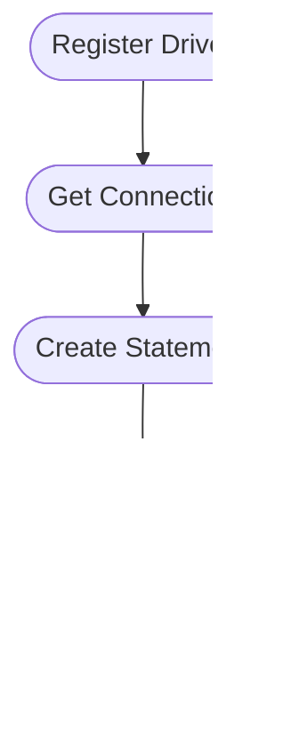

# Alur Eksekusi JDBC

1. **Register Driver** — Menyiapkan driver DBMS
2. **Get Connection** — Membuka koneksi ke *database*
3. **Create Statement** — Membuat instruksi SQL
4. **Execute Query** — Menjalankan *query* & mengambil hasil
5. **Close Connection** — Menutup koneksi

