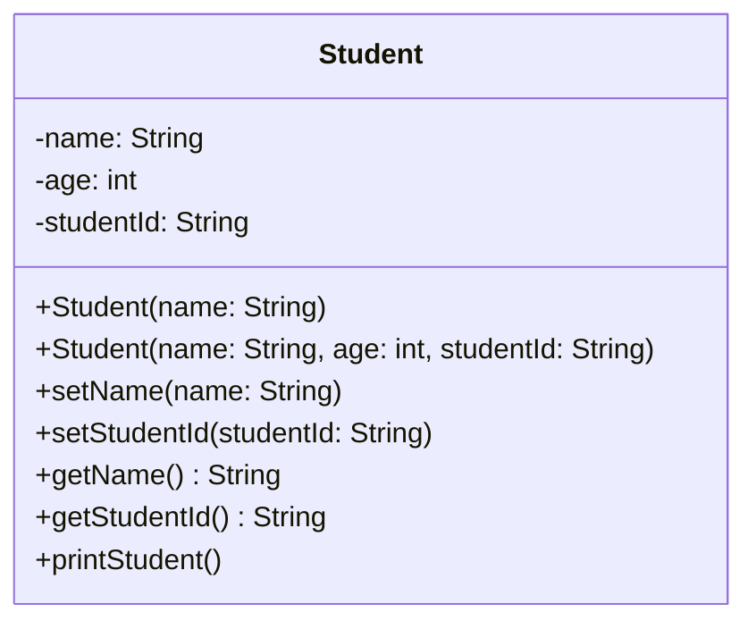

Contoh kelas `Student` dan bagaimana menggambarkannya di diagram:

<div class="grid grid-cols-[45%_50%] gap-6 items-start mt-2">

<div class="text-[0.75rem] leading-tight">

```java
class Student {
    private String name;
    private int age;
    private String studentId;

    public Student(String name) { ... }
    public Student(String name, int age, String studentId) { ... }
    
    public void setName(String name) { ... }
    public void setStudentId(String studentId) { ... }
    
    public String getName() { ... }
    public void printStudent() { ... }
}
```
</div>

<div class="flex justify-center items-center h-full pt-4">
<div class="transform scale-[0.75] origin-top">



</div>
</div>
</div>
