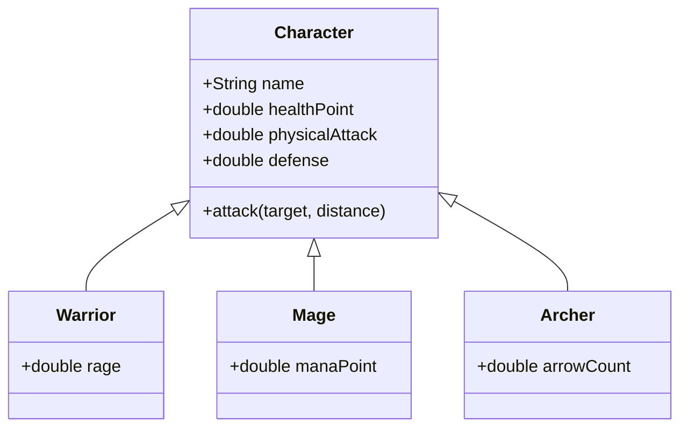

# Contoh penerapan inheritance 
*(studi kasus is-a relationship / general to specialization)*

<!-- Kolom Teks -->

  

    Pada sistem game ini, terdapat class <code>Character</code> sebagai sistem dasar (<i>parent class</i>) untuk turunan karakter lainnya. 
  

  

    Sistem game tersebut memiliki tiga spesialisasi (<i>child class</i>): 
  

  <ul class="list-disc list-inside space-y-1">
    <li><b>Warrior</b> (Serangan jarak dekat)</li>
    <li><b>Mage</b> (Serangan area sihir)</li>
    <li><b>Archer</b> (Serangan jarak jauh)</li>
  </ul>
  

    Setiap spesialisasi mewarisi seluruh atribut dan method dasar dari <code>Character</code> (seperti <code>name</code>, <code>healthPoint</code>, dll), namun bisa memiliki atribut tambahan yang spesifik sesuai spesialisasinya (contoh: <code>rage</code> untuk Warrior).
  

<!-- Kolom Gambar -->

