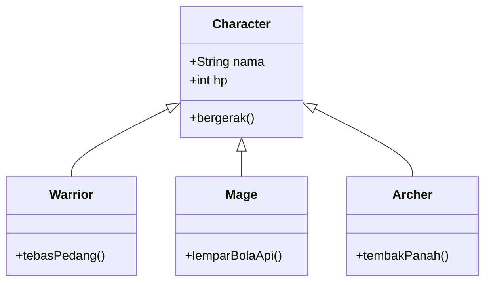

# Contoh penerapan inheritance 
*(studi kasus is-a relationship / general to specialization)*

<!-- Kolom Teks -->

  

    Misal diketahui sebuah sistem game yang terdapat class <code>Character</code> sebagai sistem dasar (<i>parent class</i>) untuk sistem turunannya. 
  

  

    Game tersebut memiliki tiga spesialisasi (<i>child class</i>): 
  

  <ul class="list-disc list-inside space-y-2">
    <li><b>Warrior</b> (pengguna pedang)</li>
    <li><b>Mage</b> (pengguna sihir)</li>
    <li><b>Archer</b> (pengguna busur & serangan jarak jauh)</li>
  </ul>
  

    Setiap spesialisasi mewarisi atribut dasar dari <code>Character</code> (seperti HP atau nama), tapi memiliki karakteristik serangan yang berbeda-beda.
  

<!-- Kolom Gambar -->

