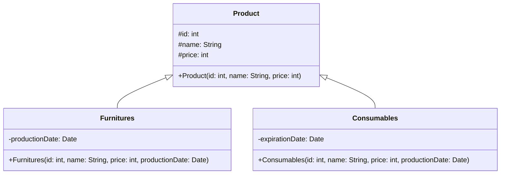

# Hubungan Antar Kelas

**Inheritance / Pewarisan**: membuat *subclass* yang mewariskan sifat-sifat dari *class* yang sudah ada. Memiliki hubungan wajib **is-a**.

```mermaid
classDiagram
  Product <|-- Furnitures
  Product <|-- Consumables
  
  class Product {
    #id: int
    #name: String
    #price: int
    +Product(id: int, name: String, price: int)
  }
  
  class Furnitures {
    -productionDate: Date
    +Furnitures(id: int, name: String, price: int, productionDate: Date)
  }
  
  class Consumables {
    -expirationDate: Date
    +Consumables(id: int, name: String, price: int, productionDate: Date)
  }
```

