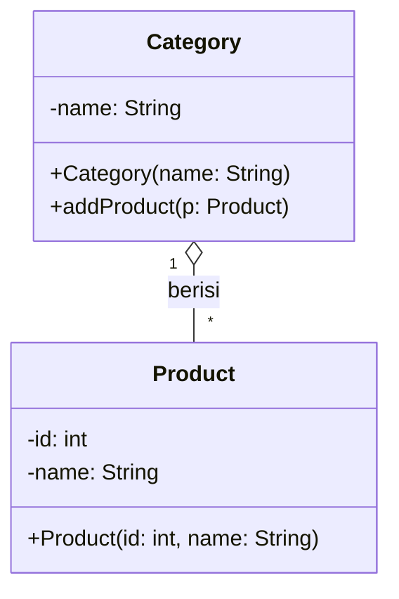

# Aggregation

<p class="mt-2">Hubungan <b>has-a</b> di mana bagian dibuat di luar lalu hanya <i>dimasukkan</i> ke keseluruhan. Bagian tetap ada walau keseluruhannya hilang.</p>

<div class="grid grid-cols-[52%_43%] gap-6 items-start mt-2">
<div class="text-[0.7rem] leading-tight">

```java
class Product {
    private int id;
    private String name;
    public Product(int id, String name) { ... }
}

class Category {
    private String name;
    private List<Product> products = new ArrayList<>();

    public Category(String name) { this.name = name; }

    public void addProduct(Product p) {
        products.add(p);   // Product datang dari luar
    }
}
```

</div>
<div class="flex justify-center items-center h-full pt-2">
<div class="transform scale-[0.8] origin-top">



</div>
</div>
</div>

<div class="mt-3 text-sm">
<ul class="list-disc pl-5 space-y-1">
<li><code>Product</code> dibuat di luar <code>Category</code>, lalu hanya dimasukkan lewat <code>addProduct()</code></li>
<li>Simbol UML: belah ketupat <b>kosong</b> di sisi keseluruhan (<code>Category</code>)</li>
</ul>
</div>
