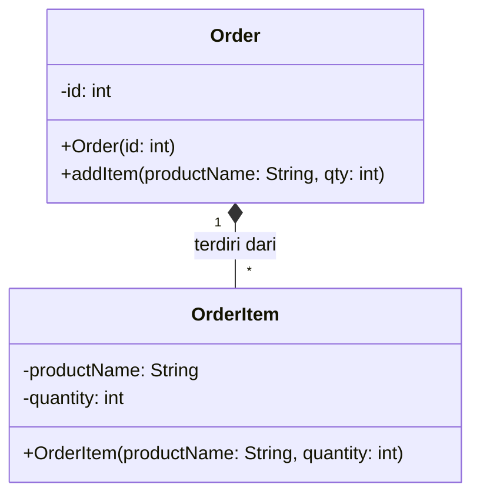

# Composition

<p class="mt-2">Hubungan <b>has-a</b> yang lebih kuat: bagian dibuat dan dimiliki <i>di dalam</i> keseluruhan, sehingga siklus hidupnya mengikuti pemiliknya.</p>

<div class="grid grid-cols-[52%_43%] gap-6 items-start mt-2">
<div class="text-[0.7rem] leading-tight">

```java
class OrderItem {
    private String productName;
    private int quantity;
    public OrderItem(String productName, int quantity) { ... }
}

class Order {
    private int id;
    private List<OrderItem> items = new ArrayList<>();

    public Order(int id) { this.id = id; }

    public void addItem(String productName, int qty) {
        // OrderItem dibuat DI DALAM Order
        items.add(new OrderItem(productName, qty));
    }
}
```

</div>
<div class="flex justify-center items-center h-full pt-2">
<div class="transform scale-[0.8] origin-top">



</div>
</div>
</div>
