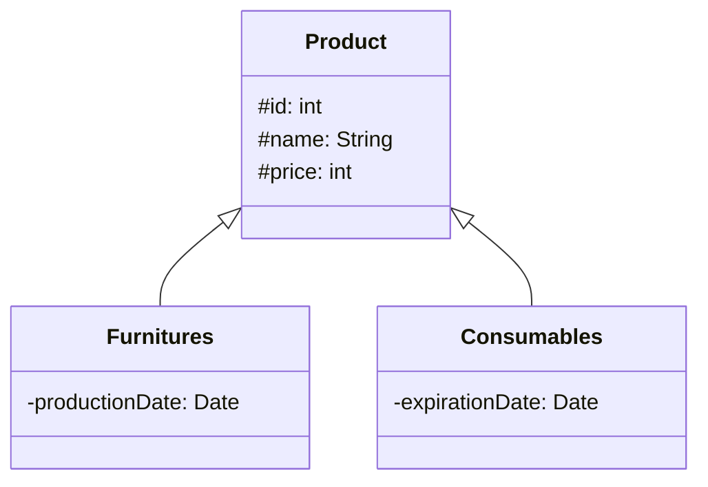

# Inheritance

<p class="mt-2">Hubungan <b>is-a</b>: <i>subclass</i> mewarisi atribut dan method dari <i>superclass</i>, lalu boleh menambahkan miliknya sendiri.</p>

<div class="grid grid-cols-[52%_43%] gap-6 items-start mt-2">
<div class="text-[0.7rem] leading-tight">

```java
class Product {
    protected int id;
    protected String name;
    protected int price;
    public Product(int id, String name, int price) { ... }
}

class Furnitures extends Product {
    private Date productionDate;

    public Furnitures(int id, String name, int price,
                      Date productionDate) {
        super(id, name, price);   // constructor Product
        this.productionDate = productionDate;
    }
}
```

</div>
<div class="flex justify-center items-center h-full pt-2">
<div class="transform scale-[0.8] origin-top">



</div>
</div>
</div>
