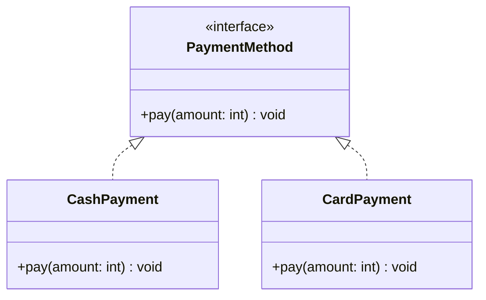

# Realization

<p class="mt-2">Class <b>memenuhi kontrak</b> sebuah interface: interface hanya menjanjikan <i>apa</i> yang bisa dilakukan, class yang menentukan <i>bagaimana</i> caranya.</p>

<div class="grid grid-cols-[52%_43%] gap-6 items-start mt-2">
<div class="text-[0.7rem] leading-tight">

```java
interface PaymentMethod {
    void pay(int amount);
}

class CashPayment implements PaymentMethod {
    @Override
    public void pay(int amount) {
        System.out.println("Bayar tunai: " + amount);
    }
}

class CardPayment implements PaymentMethod {
    @Override
    public void pay(int amount) {
        System.out.println("Bayar kartu: " + amount);
    }
}
```

</div>
<div class="flex justify-center items-center h-full pt-2">
<div class="transform scale-[0.8] origin-top">



</div>
</div>
</div>
