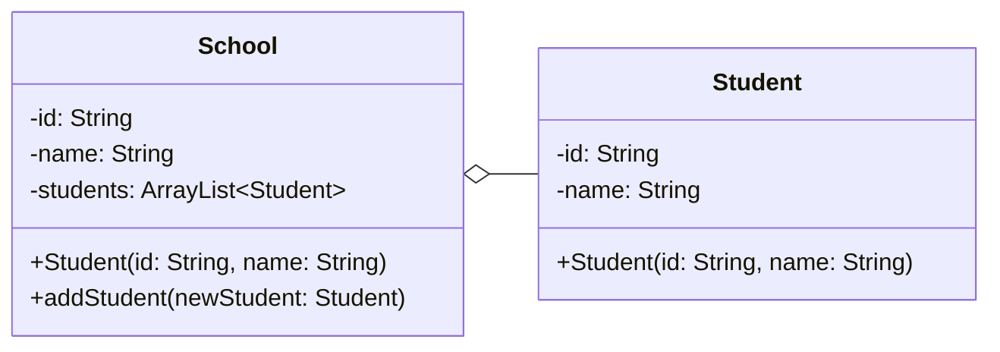

# Hubungan Antar Kelas

- **Aggregation**: merepresentasikan hubungan **has-a** antara dua class dengan lifespan yang berbeda. Jika 1 class telah mati, dependency tidak akan ikut mati.
- Bertipe *unidirectional association* (hubungan satu arah).
- Pada class diagram, ditandai dengan garis yang memiliki bentuk outline *diamond* (belah ketupat kosong).

