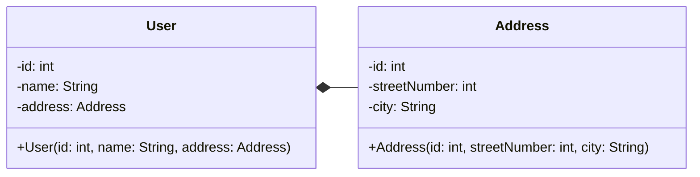

# Hubungan Antar Kelas

- **Composition**: bentuk dari Aggregation yang lebih ketat.
- Composition merepresentasikan hubungan **part-a** antara dua class dengan lifespan yang sama. Jika 1 class telah mati, maka dependency juga akan ikut mati.
- Bertipe *unidirectional association* (hubungan satu arah).
- Pada class diagram, ditandai dengan garis yang memiliki bentuk diamond yang diwarnai (solid).

