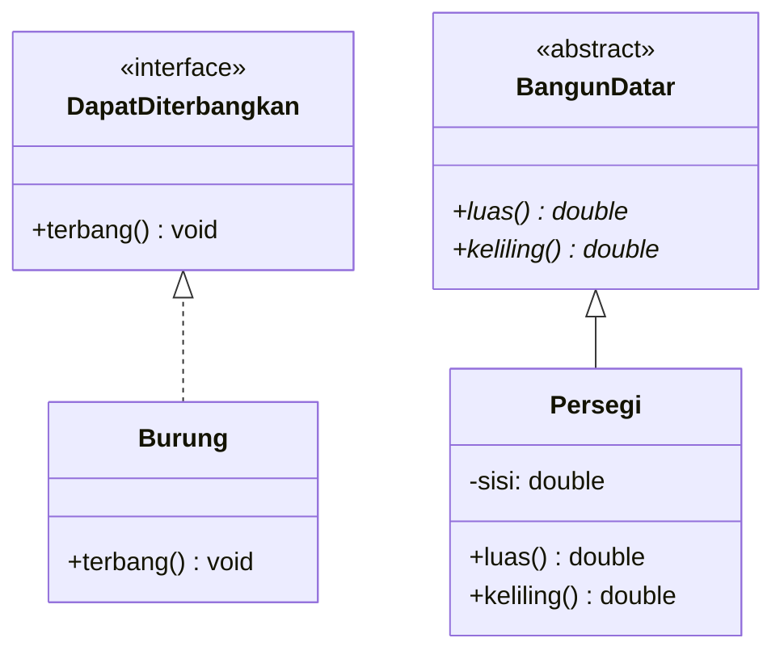

# UML Interface & Abstract Class

- **Abstract class** dituliskan dengan nama class yang dibuat *Italic* (miring).
- **Interface** dituliskan dengan penanda `<<interface>>` di atas nama kelasnya.
- Garis penyambung implementasi *interface* menggunakan garis putus-putus.

