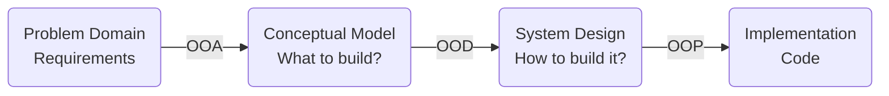

# OOD

- **Object-Oriented Design** membantu mengubah konsep-konsep dalam OOA menjadi desain mendetail yang bisa diimplementasikan dalam kodingan. 
- OOD bertindak sebagai jembatan untuk menghubungkan pemahaman akan masalah yang ada dan pembangunan solusinya.

