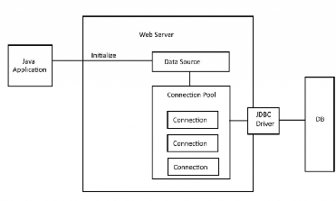

# Connection Pool

  

<h3 class="text-base font-bold text-cyan-400 mb-1">Definisi</h3>

Teknik manajemen koneksi database yang membuat dan menyimpan sejumlah objek koneksi (<em>pool</em>) secara <em>pre-allocated</em> saat aplikasi menyala.

<h3 class="text-base font-bold text-emerald-400 mb-1">Cara Kerja</h3>

Aplikasi meminjam koneksi yang sudah siap di dalam <em>pool</em> saat query, lalu mengembalikannya kembali ke <em>pool</em> (tanpa memutus/menutup koneksi fisik).

<h3 class="text-base font-bold text-yellow-400 mb-1">Manfaat</h3>

Eliminasi <em>overhead</em> otentikasi jaringan, menekan latensi query, dan mencegah database <em>overload</em>.

<h3 class="text-base font-bold text-purple-400 mb-1">Library</h3>

HikariCP (default di Spring Boot), Apache DBCP, C3P0.

Sumber: https://www.digitalocean.com/community/tutorials/connection-pooling-in-java

