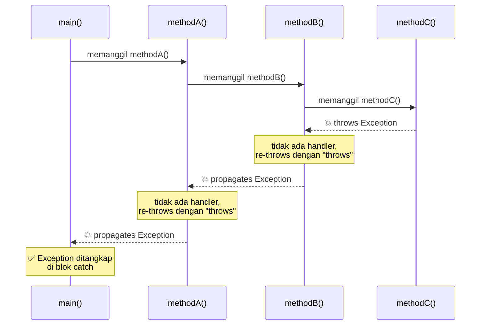

# Ilustrasi Exception Propagation

<div class="grid grid-cols-2 gap-6 mt-2 items-center">

<div>



</div>

<div class="text-sm leading-relaxed space-y-4">

<div class="bg-gray-800 bg-opacity-60 rounded-lg p-4 border border-purple-700">
<p class="font-semibold text-purple-300 mb-2">🔗 Rantai Propagation</p>
<p>Exception yang tidak ditangani di satu method akan <strong>"mengalir naik"</strong> melalui call stack, dari method yang melempar hingga method yang menangkapnya.</p>
</div>

<div v-click class="bg-gray-800 bg-opacity-60 rounded-lg p-4 border border-gray-600">

```java
static void main(String[] a) {
  try {
    methodA();           // panggil chain
  } catch (Exception e) {
    System.out.println( // tangkap di sini
      "Ditangkap: " + e.getMessage()
    );
  }
}
static void methodA() throws Exception { methodB(); }
static void methodB() throws Exception { methodC(); }
static void methodC() throws Exception {
  throw new Exception("dari methodC!");
}
```

</div>

</div>

</div>
