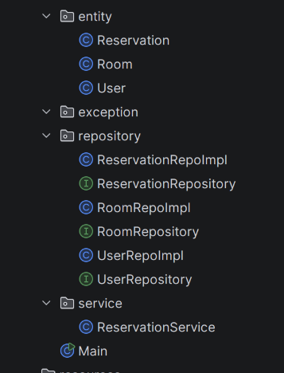

# Latihan Praktikum: Sistem Reservasi

Selesaikan instruksi berikut menggunakan <i>boilerplate</i> yang disediakan:

  <ol class="list-decimal list-outside ml-4 space-y-4">
    <li>Pelajari struktur kode dan mekanisme program (HINT: Urutan membaca bisa dimulai dari entity, repository, service, lalu class Main)</li>
    <li>Fokuskan implementasi hanya pada ReservationService dan Main</li>
    <li>Berdasarkan createReservation(), lakukan analisis dan implementasi custom exception yang dibutuhkan</li>
    <li>Kerjakan selama 20 menit</li>
  </ol>

  

