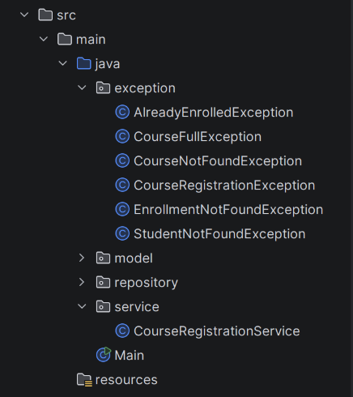

# Detail

Selesaikan instruksi berikut menggunakan <i>boilerplate</i> yang disediakan:

  <ol class="list-decimal list-outside ml-4 space-y-4">
    <li>Baca README.md untuk petunjuk lebih detail</li>
    <li>Fokuskan implementasi hanya pada exception, CourseRegistration, dan Main</li>
    <li>Exception yang dibutuhkan sudah tersedia, cukup lengkapi dengan konsep yang sudah dipelajari</li>
  </ol>
<h4 class="mt-8"> <strong>Tambahan</strong>: pelajari Layered Architecture dan implementasinya pada proyek Java</h4>

  

