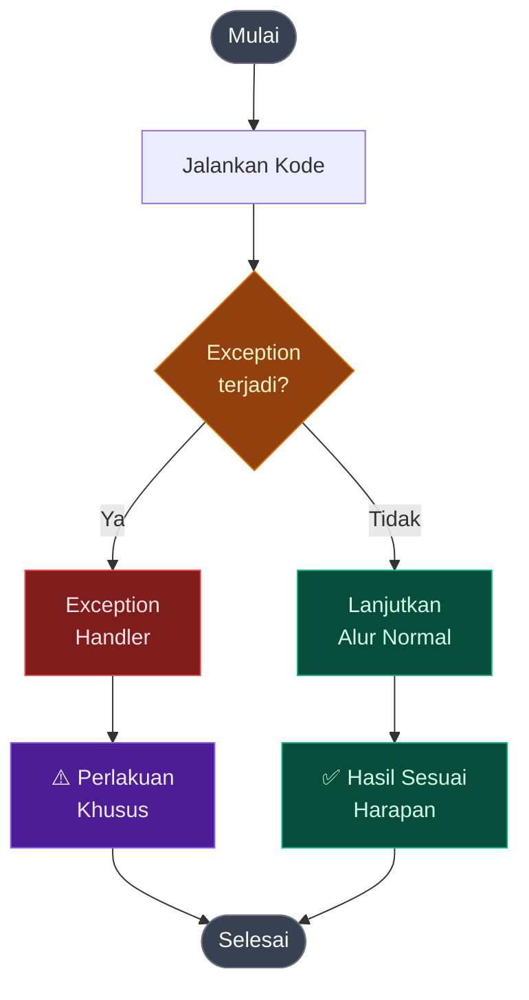

# Exception Handling

Exception handling adalah <strong>mekanisme di mana sebuah alur khusus didefinisikan</strong> ketika sebuah kejadian yang berpotensi mengganggu alur kode program utama terjadi dan berpotensi menimbulkan crash.

Exception handling berusaha untuk membuat <strong>jalur alternatif</strong> dengan menangani masalah lebih elegan daripada membiarkan program crash.

