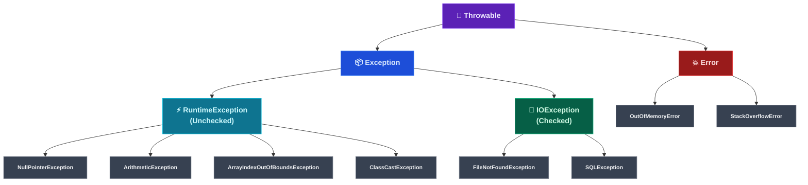

# Hierarki Exception di Java

```mermaid {scale: 0.72}
flowchart TB
  T["🎯 Throwable"] --> E["📦 Exception"]
  T --> Err["💥 Error"]

  E --> RE["⚡ RuntimeException\n(Unchecked)"]
  E --> CE["📁 IOException\n(Checked)"]

  RE --> NPE["NullPointerException"]
  RE --> AE["ArithmeticException"]
  RE --> AIOBE["ArrayIndexOutOfBoundsException"]
  RE --> CCE["ClassCastException"]

  CE --> FNF["FileNotFoundException"]
  CE --> SQL["SQLException"]

  Err --> OOM["OutOfMemoryError"]
  Err --> SOE["StackOverflowError"]

  classDef root fill:#5b21b6,stroke:#7c3aed,color:#ede9fe,font-weight:bold
  classDef exception fill:#1d4ed8,stroke:#3b82f6,color:#dbeafe,font-weight:bold
  classDef error fill:#991b1b,stroke:#dc2626,color:#fee2e2,font-weight:bold
  classDef unchecked fill:#0e7490,stroke:#06b6d4,color:#cffafe
  classDef checked fill:#065f46,stroke:#10b981,color:#d1fae5
  classDef leaf fill:#374151,stroke:#6b7280,color:#f3f4f6,font-size:12px

  class T root
  class E exception
  class Err error
  class RE unchecked
  class CE checked
  class NPE,AE,AIOBE,CCE,FNF,SQL,OOM,SOE leaf
```

